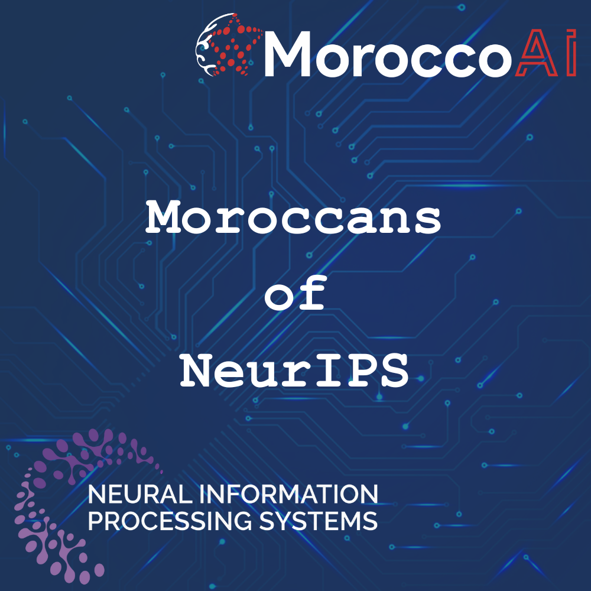

  

# Moroccans who co-authored 3 or more papers 
* Yoshua Bengio: 107
* Samy Bengio: 27
* Rachid Guerraoui: 7
* Jalal Fadili: 4
* El Mahdi El Mhamdi: 4
* Ziyad Benomar: 4
* Aymen Al Marjani: 3
* Youssef Allouah: 3
* El Mehdi Saad: 3

# Papers with at least an author from a Morocco-based affiliation
Total number : 2

* UM6P:
  * 2022: [Free Probability for predicting the performance of feed-forward fully connected neural networks](https://papers.nips.cc/paper_files/paper/2022/hash/10826a1a80f816ea98d559d7c7a97973-Abstract-Conference.html) Reda CHHAIBI, **Tariq Daouda**, Ezechiel Kahn
  * 2024: [If You Want to Be Robust, Be Wary of Initialization](https://nips.cc/virtual/2024/poster/93648) Sofiane ENNADIR, Johannes Lutzeyer, Michalis Vazirgiannis, **El Houcine Bergou**	

# Paper Awards
 * Outstanding Main Track Runner-Ups:
   * [Scaling Data-Constrained Language Models](https://papers.nips.cc/paper_files/paper/2023/hash/9d89448b63ce1e2e8dc7af72c984c196-Abstract-Conference.html). Niklas Muennighoff, Alexander Rush, Boaz Barak, Teven Le Scao, **Nouamane Tazi**, Aleksandra Piktus, Sampo Pyysalo, Thomas Wolf, Colin A. Raffel

# Miscellanous
#### Paper with the most Moroccan co-authors:
* [Improving *day-ahead* Solar Irradiance Time Series Forecasting by Leveraging Spatio-Temporal Context](https://papers.nips.cc/paper_files/paper/2023/hash/070a57c5ef1e58cc90201b11d369b3c2-Abstract-Conference.html). **Oussama Boussif**, **Ghait Boukachab**, Dan Assouline, Stefano Massaroli, Tianle Yuan, **Loubna Benabbou**, **Yoshua Bengio**
#### Female authors:
* Number of female authors : 5 (Kaoutar El Maghraoui, Loubna Benabbou, Sanae Lotfi, Madiha Nadri, Loubna Ben Allal)

# List of all the papers co-authored by Moroccans in the main track of NeurIPS

TODO: add Yoshua Bengio's papers

- 2024:
    * [On Weak Regret Analysis for Dueling Bandits](https://nips.cc/virtual/2024/poster/94336). **El Mehdi Saad**, Alexandra Carpentier, Tomáš Kocák, Nicolas Verzelen
    * [Revisiting Ensembling in One-Shot Federated Learning](https://nips.cc/virtual/2024/poster/96422). **Youssef Allouah**, Akash Dhasade, **Rachid Guerraoui**, Nirupam Gupta, Anne-marie Kermarrec, Rafael Pinot, Rafael Pires, Rishi Sharma
    * [Fine-Tuning Personalization in Federated Learning to Mitigate Adversarial Clients](https://nips.cc/virtual/2024/poster/94850). **Youssef Allouah**, **Abdellah El Mrini**, **Rachid Guerraoui**, Nirupam Gupta, Rafael Pinot
    * [Unravelling in Collaborative Learning](https://nips.cc/virtual/2024/poster/95706). Aymeric Capitaine, Etienne Boursier, Antoine Scheid, Eric Moulines, Michael Jordan, **El-Mahdi El-Mhamdi**, Alain Durmus
    * [If You Want to Be Robust, Be Wary of Initialization](https://nips.cc/virtual/2024/poster/93648) **Sofiane ENNADIR**, Johannes Lutzeyer, Michalis Vazirgiannis, **El Houcine Bergou**
    * [MTGS: A Novel Framework for Multi-Person Temporal Gaze Following and Social Gaze Prediction](https://nips.cc/virtual/2024/poster/96265). Anshul Gupta, **Samy Tafasca**, Arya Farkhondeh, Pierre Vuillecard, Jean-marc Odobez
    * [Toward Semantic Gaze Target Detection](https://nips.cc/virtual/2024/poster/96207). **Samy Tafasca**, Anshul Gupta, Victor Bros, Jean-marc Odobez
    * [How Far Can Transformers Reason? The Locality Barrier and Inductive Scratchpad](https://nips.cc/virtual/2024/poster/95947). Emmanuel Abbe, **Samy Bengio**, Aryo Lotfi, Colin Sandon, Omid Saremi
    * [The Impact of Initialization on the Finetuning Dynamics in LoRA](https://nips.cc/virtual/2024/poster/93375). **Soufiane Hayou**, Nikhil Ghosh, Bin Yu
    * add two papers of Loubna Ben Allal
    * add three papers of Ziyad Benomar
- 2023:
    * [Transformers learn through gradual rank increase](https://papers.nips.cc/paper_files/paper/2023/hash/4d69c1c057a8bd570ba4a7b71aae8331-Abstract-Conference.html). Emmanuel Abbe, **Samy Bengio**, Enric Boix-Adsera, Etai Littwin, Joshua Susskind
    * [Robust Distributed Learning: Tight Error Bounds and Breakdown Point under Data Heterogeneity](https://papers.nips.cc/paper_files/paper/2023/hash/8f182e220092f7f1fc44f3313023f5a0-Abstract-Conference.html). **Youssef Allouah**, **Rachid Guerraoui**, Nirupam Gupta, Rafael Pinot, Geovani Rizk
    * [Epidemic Learning: Boosting Decentralized Learning with Randomized Communication](https://papers.nips.cc/paper_files/paper/2023/hash/7172e147d916eef4cb1eb30016ce725f-Abstract-Conference.html). Martijn De Vos, Sadegh Farhadkhani, **Rachid Guerraoui**, Anne-marie Kermarrec, Rafael Pires, Rishi Sharma
    * [Improving *day-ahead* Solar Irradiance Time Series Forecasting by Leveraging Spatio-Temporal Context](https://papers.nips.cc/paper_files/paper/2023/hash/070a57c5ef1e58cc90201b11d369b3c2-Abstract-Conference.html). **Oussama Boussif**, **Ghait Boukachab**, Dan Assouline, Stefano Massaroli, Tianle Yuan, **Loubna Benabbou**, **Yoshua Bengio**
    * [Scaling Data-Constrained Language Models](https://papers.nips.cc/paper_files/paper/2023/hash/9d89448b63ce1e2e8dc7af72c984c196-Abstract-Conference.html). Niklas Muennighoff, Alexander Rush, Boaz Barak, Teven Le Scao, **Nouamane Tazi**, Aleksandra Piktus, Sampo Pyysalo, Thomas Wolf, Colin A. Raffel
    * [On the Complexity of Differentially Private Best-Arm Identification with Fixed Confidence](https://papers.nips.cc/paper_files/paper/2023/hash/e14de1a0ebc31d9b989f5f5528c125bb-Abstract-Conference.html). **Achraf Azize**, Marc Jourdan, **Aymen Al Marjani**, Debabrota Basu
    * [Robustifying Generalizable Implicit Shape Networks with a Tunable Non-Parametric Model](https://papers.nips.cc/paper_files/paper/2023/hash/525c95ffca1f57a10e3527d3584f3cf1-Abstract-Conference.html). **Amine Ouasfi**, **Adnane Boukhayma**
    * [Covariance-adaptive best arm identification](https://papers.nips.cc/paper_files/paper/2023/hash/e82ef7865f29b40640f486bbbe7959a7-Abstract-Conference.html). **El Mehdi Saad**, Gilles Blanchard, Nicolas Verzelen
    * [An active learning framework for multi-group mean estimation](https://papers.nips.cc/paper_files/paper/2023/hash/67390075fe466276797f489115582cdc-Abstract-Conference.html). **Abdellah Aznag**, Rachel Cummings, Adam N. Elmachtoub
    * [SimMMDG: A Simple and Effective Framework for Multi-modal Domain Generalization](https://papers.nips.cc/paper_files/paper/2023/hash/f88bec15cc4cb56b432ee040bb63f94f-Abstract-Conference.html). Hao Dong, **Ismail Nejjar**, Han Sun, Eleni Chatzi, Olga Fink
    * [Spectral Entry-wise Matrix Estimation for Low-Rank Reinforcement Learning](https://papers.nips.cc/paper_files/paper/2023/hash/f334c3375bd3744e98a0ca8eaa2403b0-Abstract-Conference.html). Stefan Stojanovic, **Yassir Jedra**, Alexandre Proutiere
    * [Advice Querying under Budget Constraint for Online Algorithms](https://papers.nips.cc/paper_files/paper/2023/hash/eda830e16044587b5082a853c4f25a90-Abstract-Conference.html). **Ziyad Benomar**, Vianney Perchet
    * [Shape Non-rigid Kinematics (SNK): A Zero-Shot Method for Non-Rigid Shape Matching via Unsupervised Functional Map Regularized Reconstruction](https://papers.nips.cc/paper_files/paper/2023/hash/dd9b76f050a86a3ded6135ad3556e786-Abstract-Conference.html). **Souhaib Attaiki**, Maks Ovsjanikov
- 2022:
  * [Learning to Reason with Neural Networks: Generalization, Unseen Data and Boolean Measures](https://papers.nips.cc/paper_files/paper/2022/hash/d4e1c24ac41ff0b82ca1b171731f0b23-Abstract-Conference.html) Emmanuel Abbe, **Samy Bengio**, Elisabetta Cornacchia, Jon Kleinberg, Aryo Lotfi, Maithra Raghu, Chiyuan Zhang
  * [Efficient and Effective Optimal Transport-Based Biclustering](https://papers.nips.cc/paper_files/paper/2022/hash/d4e1c24ac41ff0b82ca1b171731f0b23-Abstract-Conference.html) Chakib Fettal, lazhar labiod, **Mohamed NADIF**
  * [Deep Compression of Pre-trained Transformer Models](https://papers.nips.cc/paper_files/paper/2022/hash/5b5618e7d061748267d74478b7c5b1ab-Abstract-Conference.html) Naigang Wang, Chi-Chun (Charlie) Liu, Swagath Venkataramani, Sanchari Sen, Chia-Yu Chen, **Kaoutar El Maghraoui**, Vijayalakshmi (Viji) Srinivasan, Leland Chang
  * [MAgNet: Mesh Agnostic Neural PDE Solver](https://papers.nips.cc/paper_files/paper/2022/hash/cf4c7ee0734cdfe09a099cf6cd7b117a-Abstract-Conference.html) **Oussama Boussif**, **Yoshua Bengio**, **Loubna Benabbou**, Dan Assouline
  * [PAC-Bayes Compression Bounds So Tight That They Can Explain Generalization](https://papers.nips.cc/paper_files/paper/2022/hash/cbeec55c50c3367024bafab2438a021b-Abstract-Conference.html) **Sanae Lotfi**, Marc Finzi, Sanyam Kapoor, Andres Potapczynski, Micah Goldblum, Andrew G. Wilson
  * [A general approximation lower bound in Lp norm, with applications to feed-forward neural networks](https://papers.nips.cc/paper_files/paper/2022/hash/8caa10fb546ae38b3d3f0d32ecc866f0-Abstract-Conference.html) **El Mehdi Achour**, Armand Foucault, Sébastien Gerchinovitz, François Malgouyres
  * [The Franz-Parisi Criterion and Computational Trade-offs in High Dimensional Statistics](https://papers.nips.cc/paper_files/paper/2022/hash/daff682411a64632e083b9d6665b1d30-Abstract-Conference.html) Afonso S Bandeira, **Ahmed El Alaoui**, Samuel Hopkins, Tselil Schramm, Alexander S Wein, Ilias Zadik
  * [A Deep Reinforcement Learning Framework for Column Generation](https://papers.nips.cc/paper_files/paper/2022/hash/3ecfe5c632afb7d96a2337b18ff99b1f-Abstract-Conference.html) Cheng Chi, **Amine Aboussalah**, Elias Khalil, Juyoung Wang, Zoha Sherkat-Masoumi
  * [Beyond IID: data-driven decision-making in heterogeneous environments](https://papers.nips.cc/paper_files/paper/2022/hash/974ff7b5bf08dbf9400b5d599a39c77f-Abstract-Conference.html) Omar Besbes, Will Ma, **Omar Mouchtaki**
  * [Near Instance-Optimal PAC Reinforcement Learning for Deterministic MDPs](https://papers.nips.cc/paper_files/paper/2022/hash/39c60dda48ebf0a2e5dda52ce08eb5c8-Abstract-Conference.html) Andrea Tirinzoni, **Aymen Al Marjani**, Emilie Kaufmann
  * [When Privacy Meets Partial Information: A Refined Analysis of Differentially Private Bandits](https://papers.nips.cc/paper_files/paper/2022/hash/cffbaf4f47546ece96bb42c0edda40ee-Abstract-Conference.html) **Achraf Azize**, Debabrota Basu
  * [Free Probability for predicting the performance of feed-forward fully connected neural networks](https://papers.nips.cc/paper_files/paper/2022/hash/10826a1a80f816ea98d559d7c7a97973-Abstract-Conference.html) Reda CHHAIBI, **Tariq Daouda**, Ezechiel Kahn
  * [Benchopt: Reproducible, efficient and collaborative optimization benchmarks](https://papers.nips.cc/paper_files/paper/2022/hash/a30769d9b62c9b94b72e21e0ca73f338-Abstract-Conference.html) Thomas Moreau, Mathurin Massias, Alexandre Gramfort, Pierre Ablin, Pierre-Antoine Bannier, Benjamin Charlier, Mathieu Dagréou, Tom Dupre la Tour, Ghislain DURIF, Cassio F. Dantas, Quentin Klopfenstein, Johan Larsson, En Lai, Tanguy Lefort, Benoît Malézieux, **Badr MOUFAD**, Binh T. Nguyen, Alain Rakotomamonjy, Zaccharie Ramzi, Joseph Salmon, Samuel Vaiter
  * [An alpha-No-Regret Algorithm For Graphical Bilinear Bandits](https://papers.nips.cc/paper_files/paper/2022/hash/79a10a4977d1e21c319060e125406bd6-Abstract-Conference.html) Geovani Rizk, Igor Colin, Albert Thomas, **Rida Laraki**, Yann Chevaleyre
  * [Smooth Fictitious Play in Stochastic Games with Perturbed Payoffs and Unknown Transitions](https://papers.nips.cc/paper_files/paper/2022/hash/7f7fa581cc8a1970a4332920cdf87395-Abstract-Conference.html) Lucas Baudin, **Rida Laraki**
- 2021:
  * [Improving Anytime Prediction with Parallel Cascaded Networks and a Temporal-Difference](https://papers.nips.cc/paper_files/paper/2021/hash/e894d787e2fd6c133af47140aa156f00-Abstract.html) Loss Michael Iuzzolino, Michael C. Mozer, **Samy Bengio**
  * [Learnable Fourier Features for Multi-dimensional Spatial Positional Encoding](https://papers.nips.cc/paper_files/paper/2021/hash/84c2d4860a0fc27bcf854c444fb8b400-Abstract.html) Yang Li, Si Si, Gang Li, Cho-Jui Hsieh, **Samy Bengio**
  * [Collaborative Learning in the Jungle (Decentralized, Byzantine, Heterogeneous, Asynchronous and Nonconvex Learning)](https://papers.nips.cc/paper_files/paper/2021/hash/84c2d4860a0fc27bcf854c444fb8b400-Abstract.html) **El Mahdi El-Mhamdi**, Sadegh Farhadkhani, **Rachid Guerraoui**, Arsany Guirguis, Lê-Nguyên Hoang, Sébastien Rouault
  * [Federated Multi-Task Learning under a Mixture of Distributions](https://papers.nips.cc/paper_files/paper/2021/hash/82599a4ec94aca066873c99b4c741ed8-Abstract.html) **Othmane Marfoq**, Giovanni Neglia, Aurélien Bellet, Laetitia Kameni, Richard Vidal
  * [Re-ranking for image retrieval and transductive few-shot classification](https://papers.nips.cc/paper_files/paper/2021/hash/d9fc0cdb67638d50f411432d0d41d0ba-Abstract.html) Xi SHEN, Yang Xiao, Shell Xu Hu, **Othman Sbai**, Mathieu Aubry
  * [Dangers of Bayesian Model Averaging under Covariate Shift](https://papers.nips.cc/paper_files/paper/2021/hash/1ab60b5e8bd4eac8a7537abb5936aadc-Abstract.html) Pavel Izmailov, Patrick Nicholson, **Sanae Lotfi**, Andrew G. Wilson
  * [Navigating to the Best Policy in Markov Decision Processes](https://papers.nips.cc/paper_files/paper/2021/hash/d9896106ca98d3d05b8cbdf4fd8b13a1-Abstract.html) **Aymen Al Marjani**, Aurélien Garivier, Alexandre Proutiere
  * [Online Sign Identification: Minimization of the Number of Errors in Thresholding Bandits](https://papers.nips.cc/paper_files/paper/2021/hash/9a3f54913bf27e648d1759c18d007165-Abstract.html) **Reda Ouhamma**, Odalric-Ambrym Maillard, Vianney Perchet
  * [Stochastic Online Linear Regression: the Forward Algorithm to Replace Ridge](https://papers.nips.cc/paper_files/paper/2021/hash/cca289d2a4acd14c1cd9a84ffb41dd29-Abstract.html) **Reda Ouhamma**, Odalric-Ambrym Maillard, Vianney Perchet
  * [Sequential Algorithms for Testing Closeness of Distributions](https://papers.nips.cc/paper_files/paper/2021/hash/609c5e5089a9aa967232aba2a4d03114-Abstract.html) **Aadil Oufkir**, Omar Fawzi, Nicolas Flammarion, Aurélien Garivier
  * [Regularization in ResNet with Stochastic Depth](https://papers.nips.cc/paper_files/paper/2021/hash/82ba9d6eee3f026be339bb287651c3d8-Abstract.html) **Soufiane Hayou**, Fadhel Ayed
  * [Deconditional Downscaling with Gaussian Processes](https://papers.nips.cc/paper_files/paper/2021/hash/94aef38441efa3380a3bed3faf1f9d5d-Abstract.html) Siu Lun Chau, **Shahine Bouabid**, Dino Sejdinovic
  * [Supervising the Transfer of Reasoning Patterns in VQA](https://papers.nips.cc/paper_files/paper/2021/hash/9766527f2b5d3e95d4a733fcfb77bd7e-Abstract.html) Corentin Kervadec, Christian Wolf, Grigory Antipov, Moez Baccouche, **Madiha Nadri**
  * [Fast rates for prediction with limited expert advice](https://papers.nips.cc/paper_files/paper/2021/hash/c688defd45ad6638febd469adb09ddf7-Abstract.html) **El Mehdi Saad**, Gilles Blanchard
  * [An analysis of Ermakov-Zolotukhin quadrature using kernels](https://papers.nips.cc/paper_files/paper/2021/hash/e531e258fe3098c3bdd707c30a687d73-Abstract.html) **Ayoub Belhadji**
- 2020:
  * [Memory Based Trajectory-conditioned Policies for Learning from Sparse Rewards](https://papers.nips.cc/paper_files/paper/2020/hash/2df45244f09369e16ea3f9117ca45157-Abstract.html) Yijie Guo, Jongwook Choi, Marcin Moczulski, Shengyu Feng, **Samy Bengio**, Mohammad Norouzi, Honglak Lee
  * [Ultra-Low Precision 4-bit Training of Deep Neural Networks](https://papers.nips.cc/paper_files/paper/2020/hash/13b919438259814cd5be8cb45877d577-Abstract.html) Xiao Sun, Naigang Wang, Chia-Yu Chen, Jiamin Ni, Ankur Agrawal, Xiaodong Cui, Swagath Venkataramani, **Kaoutar El Maghraoui**, Vijayalakshmi (Viji) Srinivasan, Kailash Gopalakrishnan
  * [Throughput-Optimal Topology Design for Cross-Silo Federated Learning](https://papers.nips.cc/paper_files/paper/2020/hash/e29b722e35040b88678e25a1ec032a21-Abstract.html) **Othmane MARFOQ**, CHUAN XU, Giovanni Neglia, Richard Vidal
  * [Entropic Optimal Transport between Unbalanced Gaussian Measures has a Closed Form](https://papers.nips.cc/paper_files/paper/2020/hash/766e428d1e232bbdd58664b41346196c-Abstract.html) **Hicham Janati**, Boris Muzellec, Gabriel Peyré, Marco Cuturi
  * [VarGrad: A Low-Variance Gradient Estimator for Variational Inference](https://papers.nips.cc/paper_files/paper/2020/hash/9c22c0b51b3202246463e986c7e205df-Abstract.html) Lorenz Richter, **Ayman Boustati**, Nikolas Nüsken, Francisco Ruiz, Omer Deniz Akyildiz
  * [Optimal Best-arm Identification in Linear Bandits](https://papers.nips.cc/paper_files/paper/2020/hash/7212a6567c8a6c513f33b858d868ff80-Abstract.html) **Yassir Jedra**, Alexandre Proutiere
  * [Practical Quasi-Newton Methods for Training Deep Neural Networks](https://papers.nips.cc/paper_files/paper/2020/hash/192fc044e74dffea144f9ac5dc9f3395-Abstract.html) Donald Goldfarb, Yi Ren, **Achraf Bahamou**
  * [Generalised Bayesian Filtering via Sequential Monte Carlo](https://papers.nips.cc/paper_files/paper/2020/hash/04ecb1fa28506ccb6f72b12c0245ddbc-Abstract.html) **Ayman Boustati**, Omer Deniz Akyildiz, Theodoros Damoulas, Adam Johansen
- 2019:
  * [Towards closing the gap between the theory and practice of SVRG](https://papers.nips.cc/paper_files/paper/2019/hash/eb1e78328c46506b46a4ac4a1e378b91-Abstract.html) **Othmane Sebbouh**, Nidham Gazagnadou, Samy Jelassi, Francis Bach, Robert Gower
  * [Transfusion: Understanding Transfer Learning for Medical Imaging](https://papers.nips.cc/paper_files/paper/2019/hash/cd00692c3bfe59267d5ecfac5310286c-Abstract.html) Maithra Raghu, Chiyuan Zhang, Jon Kleinberg, **Samy Bengio**
  * [Generalization Bounds in the Predict-then-Optimize Framework](https://papers.nips.cc/paper_files/paper/2019/hash/5a0c828364dbf6dd406139dab7b25398-Abstract.html) **Othman El Balghiti**, Adam N. Elmachtoub, Paul Grigas, Ambuj Tewari
  * [Learning about an exponential amount of conditional distributions](https://papers.nips.cc/paper_files/paper/2019/hash/a70145bf8b173e4496b554ce57969e24-Abstract.html) **Mohamed Belghazi**, Maxime Oquab, David Lopez-Paz
  * [Kernel quadrature with DPPs](https://papers.nips.cc/paper_files/paper/2019/hash/7012ef0335aa2adbab58bd6d0702ba41-Abstract.html) **Ayoub Belhadji**, Rémi Bardenet, Pierre Chainais
- 2018:
  * [Content preserving text generation with attribute controls](https://papers.nips.cc/paper_files/paper/2018/hash/7cf64379eb6f29a4d25c4b6a2df713e4-Abstract.html) Lajanugen Logeswaran, Honglak Lee, **Samy Bengio**
  * [Insights on representational similarity in neural networks with canonical correlation](https://papers.nips.cc/paper_files/paper/2018/hash/a7a3d70c6d17a73140918996d03c014f-Abstract.html) Ari Morcos, Maithra Raghu, **Samy Bengio**
  * [Large Margin Deep Networks for Classification](https://papers.nips.cc/paper_files/paper/2018/hash/42998cf32d552343bc8e460416382dca-Abstract.html) Gamaleldin Elsayed, Dilip Krishnan, Hossein Mobahi, Kevin Regan, **Samy Bengio**
  * [Unsupervised Attention-guided Image-to-Image Translation](https://papers.nips.cc/paper_files/paper/2018/hash/4e87337f366f72daa424dae11df0538c-Abstract.html) **Youssef Alami Mejjati**, Christian Richardt, James Tompkin, Darren Cosker, Kwang In Kim
- 2017:
  * [Machine Learning with Adversaries: Byzantine Tolerant Gradient Descent](https://papers.nips.cc/paper_files/paper/2017/hash/812b4ba287f5ee0bc9d43bbf5bbe87fb-Abstract.html) Peva Blanchard, **El Mahdi El Mhamdi**, **Rachid Guerraoui**, Julien Stainer
  * [Dynamic Safe Interruptibility for Decentralized Multi-Agent Reinforcement Learning](https://papers.nips.cc/paper_files/paper/2017/hash/f4b9ec30ad9f68f89b29639786cb62ef-Abstract.html) **El Mahdi El Mhamdi**, **Rachid Guerraoui**, Hadrien Hendrikx, Alexandre Maurer
  * [Beyond Worst-case: A Probabilistic Analysis of Affine Policies in Dynamic Optimization](https://papers.nips.cc/paper_files/paper/2017/hash/01a0683665f38d8e5e567b3b15ca98bf-Abstract.html) **Omar El Housni**, Vineet Goyal
- 2016:
  * [Reward Augmented Maximum Likelihood for Neural Structured Prediction](https://papers.nips.cc/paper_files/paper/2016/hash/2f885d0fbe2e131bfc9d98363e55d1d4-Abstract.html) Mohammad Norouzi, **Samy Bengio**, zhifeng Chen, Navdeep Jaitly, Mike Schuster, Yonghui Wu, Dale Schuurmans
  * [Can Active Memory Replace Attention?](https://papers.nips.cc/paper_files/paper/2016/hash/fb8feff253bb6c834deb61ec76baa893-Abstract.html) Łukasz Kaiser, **Samy Bengio**
  * [An Online Sequence-to-Sequence Model Using Partial Conditioning](https://papers.nips.cc/paper_files/paper/2016/hash/312351bff07989769097660a56395065-Abstract.html) Navdeep Jaitly, Quoc V. Le, Oriol Vinyals, Ilya Sutskever, David Sussillo, **Samy Bengio**
  * [Sparse Support Recovery with Non-smooth Loss Functions](https://papers.nips.cc/paper_files/paper/2016/hash/5a1e3a5aede16d438c38862cac1a78db-Abstract.html) Kévin Degraux, Gabriel Peyré, **Jalal Fadili**, Laurent Jacques
  * [A Multi-step Inertial Forward-Backward Splitting Method for Non-convex Optimization](https://papers.nips.cc/paper_files/paper/2016/hash/ea6b2efbdd4255a9f1b3bbc6399b58f4-Abstract.html) Jingwei Liang, **Jalal Fadili**, Gabriel Peyré
- 2015:
  * [Scheduled Sampling for Sequence Prediction with Recurrent Neural Networks](https://papers.nips.cc/paper_files/paper/2015/hash/e995f98d56967d946471af29d7bf99f1-Abstract.html) **Samy Bengio**, Oriol Vinyals, Navdeep Jaitly, Noam Shazeer
  * [Fast Randomized Kernel Ridge Regression with Statistical Guarantees](https://papers.nips.cc/paper_files/paper/2015/hash/f3f27a324736617f20abbf2ffd806f6d-Abstract.html) **Ahmed Alaoui**, Michael W. Mahoney
- 2014:
  * [Local Linear Convergence of Forward--Backward under Partial Smoothness](https://papers.nips.cc/paper_files/paper/2014/hash/522a9ae9a99880d39e5daec35375e999-Abstract.html) Jingwei Liang, **Jalal Fadili**, Gabriel Peyré
- 2013:
  * [DeViSE: A Deep Visual-Semantic Embedding Model](https://papers.nips.cc/paper_files/paper/2013/hash/7cce53cf90577442771720a370c3c723-Abstract.html) Andrea Frome, Greg S. Corrado, Jon Shlens, **Samy Bengio**, Jeff Dean, Marc'Aurelio Ranzato, Tomas Mikolov
- 2012:
  * [A quasi-Newton proximal splitting method](https://papers.nips.cc/paper_files/paper/2012/hash/e034fb6b66aacc1d48f445ddfb08da98-Abstract.html) Stephen Becker, **Jalal Fadili**
- 2010:
  * [Label Embedding Trees for Large Multi-Class Tasks](https://papers.nips.cc/paper_files/paper/2010/hash/06138bc5af6023646ede0e1f7c1eac75-Abstract.html) **Samy Bengio**, Jason Weston, David Grangier
- 2009:
  * [An Online Algorithm for Large Scale Image Similarity Learning](https://papers.nips.cc/paper_files/paper/2009/hash/e97ee2054defb209c35fe4dc94599061-Abstract.html) Gal Chechik, Uri Shalit, Varun Sharma, **Samy Bengio**
  * [Group Sparse Coding](https://papers.nips.cc/paper_files/paper/2009/hash/3b3dbaf68507998acd6a5a5254ab2d76-Abstract.html) **Samy Bengio**, Fernando Pereira, Yoram Singer, Dennis Strelow
- 2006:
  * [Multi-dynamic Bayesian Networks](https://papers.nips.cc/paper_files/paper/2006/hash/e4a93f0332b2519177ed55741ea4e5e7-Abstract.html) **Karim Filali**, Jeff A. Bilmes
- 2005:
  * [A Probabilistic Interpretation of SVMs with an Application to Unbalanced Classification](https://papers.nips.cc/paper_files/paper/2005/hash/f804d21145597e42851fa736e221da3f-Abstract.html) Yves Grandvalet, Johnny Mariethoz, **Samy Bengio**
  * [Benchmarking Non-Parametric Statistical Tests](https://papers.nips.cc/paper_files/paper/2005/hash/eb9fc349601c69352c859c1faa287874-Abstract.html) Mikaela Keller, **Samy Bengio**, Siew Wong
  * [Learning Influence among Interacting Markov Chains](https://papers.nips.cc/paper_files/paper/2005/hash/f6c9dc70ecfd8f90ba8598aa2401cd1a-Abstract.html) Dong Zhang, Daniel Gatica-perez, **Samy Bengio**, Deb Roy
- 2002:
  * [An Asynchronous Hidden Markov Model for Audio-Visual Speech Recognition](https://papers.nips.cc/paper_files/paper/2002/hash/2b45c629e577731c4df84fc34f936a89-Abstract.html) **Samy Bengio**
- 2001:
  * [A Parallel Mixture of SVMs for Very Large Scale Problems](https://papers.nips.cc/paper_files/paper/2001/hash/36ac8e558ac7690b6f44e2cb5ef93322-Abstract.html) Ronan Collobert, **Samy Bengio**, **Yoshua Bengio**
- 2000:
  * [New Approaches Towards Robust and Adaptive Speech Recognition](https://papers.nips.cc/paper_files/paper/2000/hash/cb79f8fa58b91d3af6c9c991f63962d3-Abstract.html) Hervé Bourlard, **Samy Bengio**, Katrin Weber
- 1999:
  * [Modeling High-Dimensional Discrete Data with Multi-Layer Neural Networks](https://papers.nips.cc/paper_files/paper/1999/hash/e6384711491713d29bc63fc5eeb5ba4f-Abstract.html) **Yoshua Bengio**, **Samy Bengio**
- 1997:
  * [Shared Context Probabilistic Transducers](https://papers.nips.cc/paper_files/paper/1997/hash/bad5f33780c42f2588878a9d07405083-Abstract.html) **Yoshua Bengio**, **Samy Bengio**, Jean-Franc Isabelle, Yoram Singer
- 1990:
  * [Speech Recognition Using Connectionist Approaches](https://papers.nips.cc/paper_files/paper/1990/hash/a01a0380ca3c61428c26a231f0e49a09-Abstract.html) **Khalid Choukri**
- 1989:
  * [A Neural Network to Detect Homologies in Proteins](https://papers.nips.cc/paper_files/paper/1989/hash/ca46c1b9512a7a8315fa3c5a946e8265-Abstract.html) **Yoshua Bengio**, **Samy Bengio**, Yannick Pouliot, Patrick Agin
